<h3><code>gaurav@github ~ $ ./contributions.sh</code></h3>

  

<h3><code>gaurav@github ~ $ whoami</code></h3>
<table>
  <tr>
    <td valign="top"></td>
    <td valign="top"></td>
  </tr>
</table>

---

### How this works 🛠️

This profile README acts like a live terminal. It runs entirely on client-rendered SVG animations and stays up to date using a local automation pipeline powered by Python and GitHub Actions:
- **`avi-ascii.svg`**: A self-typing ASCII art portrait of my profile avatar, rendered row-by-row with individual SMIL clip-path animations and an animated command cursor.
- **`info-card.svg`**: A custom Neofetch-style terminal panel presenting my stack, highlights, and story, fading in line-by-line using CSS transitions.
- **`contrib-heatmap.svg`**: An animated 53-week contribution calendar displaying real GitHub stats that slide down diagonally on load.

No external widgets, no third-party APIs, no performance bottlenecks, and automatically responsive to both **GitHub Light and Dark Modes** using CSS media queries inside the SVGs.

*Automatically updated every day at 06:17 UTC via GitHub Actions cron.*
